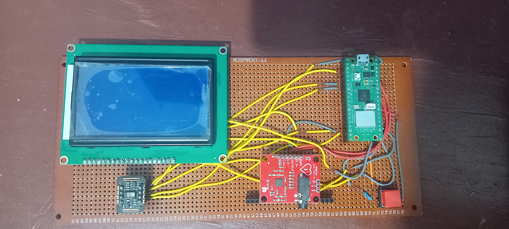
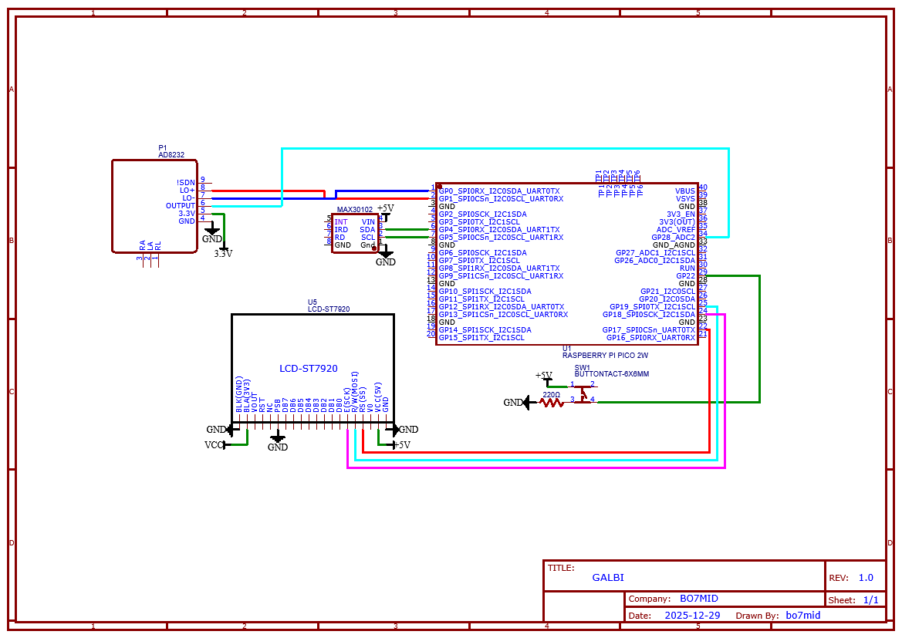
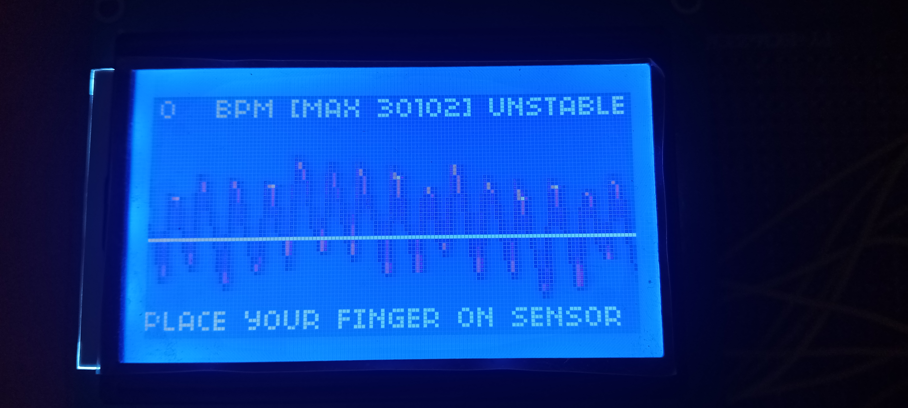
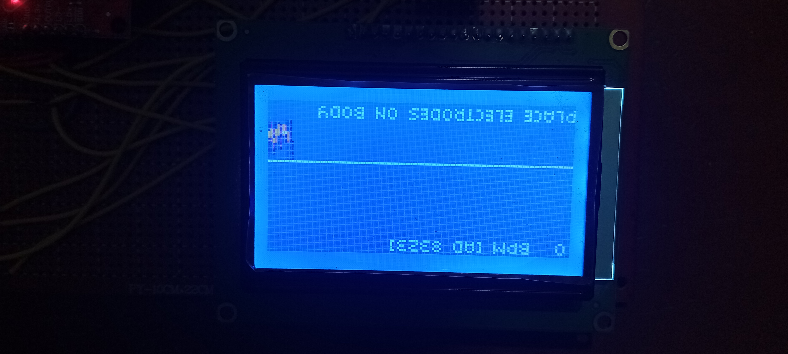
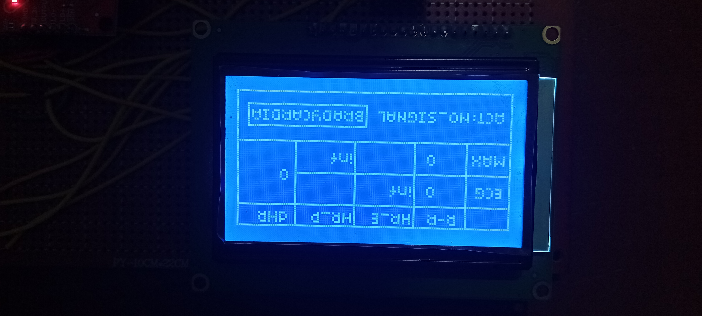

<h1 align="center">GALBI</h1>

  

<h2 align="center">GALBI: a heart monitor project</h2>

## ✨ What's GALBI?
Galbi is a *DIY Home Monitor* capable of visualizing **heart rate waveform** and giving feedbacks about it.

  

## 🎨 Features
- ✅ HR Waveform on LCD

- ✅ HR from two different modules

- ✅ Table to summarize rusults

- ✅ Button to cycle between three pages

## 🚀 Quickstart

### 💻 Installation
> Arduino IDE is required for easy installation
- What we need:

| Module           | Why We need it                                                                              | Qte                                                                     |
|------------------|---------------------------------------------------------------------------------------------|-------------------------------------------------------------------------|
| RAS PI PICO W    | the brain of the whole operations (it also has a 12-bit ADC)                                | 1                                                                       |
| LCD display      |(st7920 IC) to show to readings                                                              | 1                                                                       |
| AD 8232          | ECG MODULE                                                                                  | 1                                                                       |
| MAX 30102        | Detects heart beats                                                                         | 1                                                                       |
| Button           | Switch between hr plot from AD, MAX and the Table pages                                     | 1                                                                       |
| Jumper wires     |  connect every thing                                                                        | ****LOT****      (~20)                                                  |

- How to connect all the components:
  ### wiring

- Upload the code to RAS PI PICO W:
  - upload [`script`](src/main/main.ino) to the pico.

### 🛠️ Be cautious
- ❌ **THIS PROJECT CANNOT BE RELIED ON FOR MEDICAL DIAGNOSIS**
- ❌ **THIS PROJECT DAOES NOT CLAIM MEDICAL ACCURACY**
-  Place your finger firmly on the MAX30102 sensor. If the HR plot seems off, try vary the pressure on the sensor.

## 🚀 It's TEST TIME
- 1st PAGE: place your finger on the sensor and wait for few seconds
  
- 2nd PAGE: place ECG electrodes on your body then you'll get the plot
  
- 3rd PAGE: resume table
  
